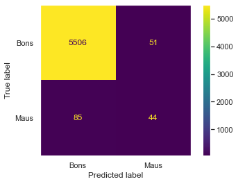

# BYTEBANK

Protótipo de avaliação de concessão de crédito, utilizando o streamlit para rodar o modelo.  
O projeto foi desenvolvido dentro do bootcamp de data science da Alura, baseado [nesse repositório](https://github.com/alura-cursos/Avaliacao_Credito).

Para acessar projeto, basta clicar no [link](https://share.streamlit.io/johnnyyamanaka/avaliador-credito/simulador_avaliador_credito.py).

## Sobre o modelo
O modelo final que está rodando no projeto é uma Random Forest com o melhor resultado obtido nos testes - um AUC de 0.84082. Porém analisando os resultados obtidos, faz se necessário a melhora do modelo, pois ele o valor do recall para classe mau ainda está muito baixo - 0.34. Isso quer dizer que o modelo não consegue acertar bem quando se trata de um mau pagador. Veja a matriz de confusão:

Para ser um modelo confiável, o modelo precisa aumentar consideravelmente sua pontuação no recall, ou seja, a capacidade do modelo identificar os casos onde os clientes são maus pagadores.
